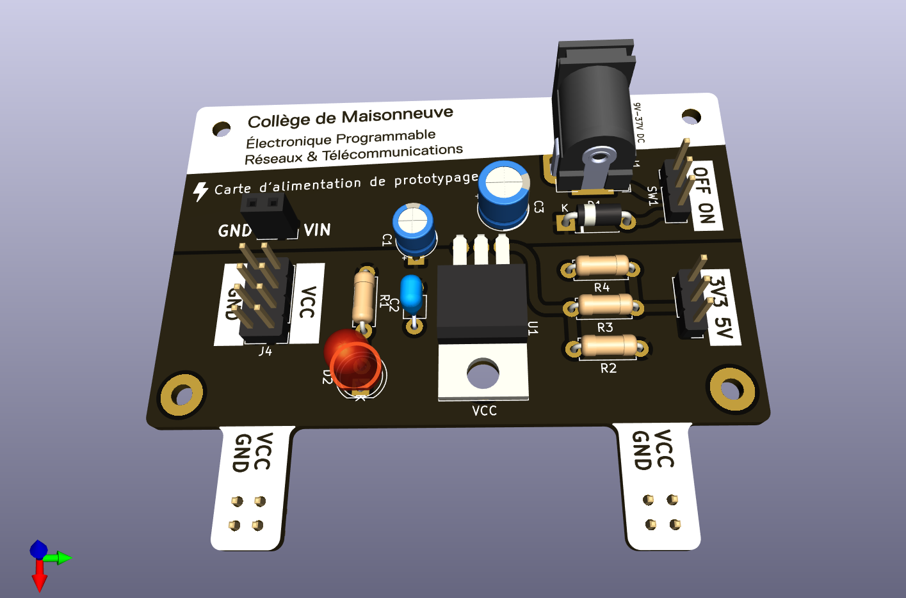

# Carte d'alimentation de prototypage

Cette carte génére un tension de 3.3V ou 5V et se branche sur une plaquette de prototypage(breadboard).

La plage de tension d'entrée recommandée est 9V à 37V.
 
 
